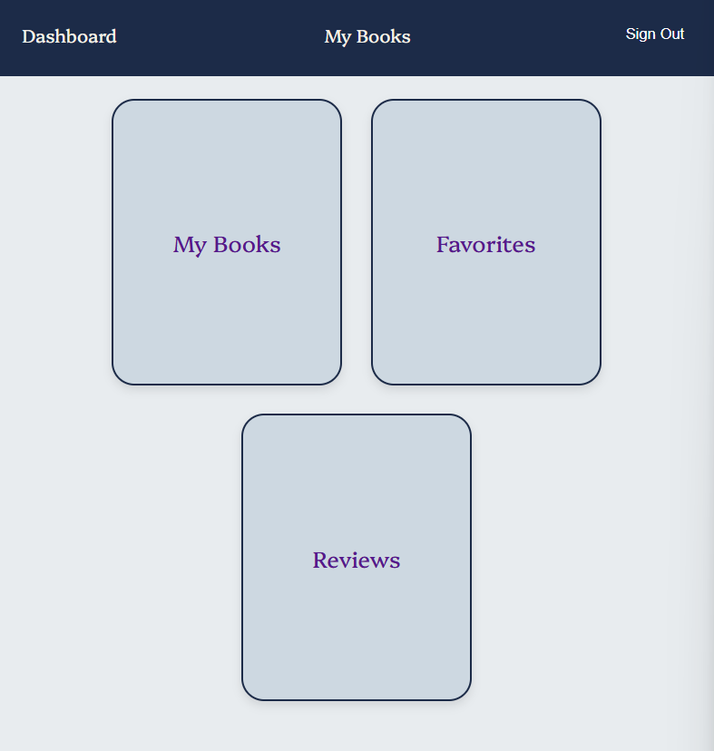

# Project Name
Books Tracker

## Overview
A booking tracking app that allows you to add books, view, update, and remove books.

## Screenshot

## Technologies Used
- **CSS**
- **EJS**
- **MongoDB**
- **JS**

## Getting Started
1. Sign up to create an account, or Sign in if you already have an account.
2. Add books by clicking on 'My Books' link on navbar.
3. Edit/Delete books by clicking on the books card.
4. Add book to favorites by clicking on 'add to favorites', and access favorites page from dashboard.
5. After finishing reading, change reading status to 'Done Reading' to add review.
6. Access posted reviews from dashboard.

## Features
- Add new books.
- Update existing books.
- Delete existing books.
- Add books to favorites.
- Post reviews.
- Filter books by their reading status.
- Search books by their title.

## Future Enhancements
- Allow users to view each other profiles.
- Allow users to add recommendations for other users.
